# IC Memo Production Workflow

### Company-Side Fundraising Memo — Blueprint v2.0

> **100+ action steps** · **7 stages** · **5 validation gates** · **18 content sections**
> Stage-agnostic framework: Series A through Pre-IPO

---

## Color System

| Color | Phase | Sections |
|:---:|---|---|
| 🟣 | **Pre-Production** | Scoping, Ownership, Page Budget |
| 🟡 | **Validation Gates** | Gates 1–5 (hard checkpoints) |
| 🔵 | **Stage 1** — The Hook | Sections 1–2 |
| 🟢 | **Stage 2** — The Opportunity | Sections 3–5 |
| 🟩 | **Stage 3** — The Proof | Sections 6–8 |
| 🟤 | **Stage 4** — The Team | Sections 9–10 |
| 🔷 | **Stage 5** — The Numbers | Sections 11–13 |
| 🟠 | **Stage 6** — The Ask | Sections 14–15 |
| 🔴 | **Stage 7** — Risk & Close | Sections 16–18 |
| ⭐ | **Executive Summary** | Written last, after all stages |
| ✅ | **Decision & Sign-Off** | Section 19 + Gate 5 |

---

## Pre-Production: Transaction Intake


## Pre-Production: Ownership & Scoping Decisions

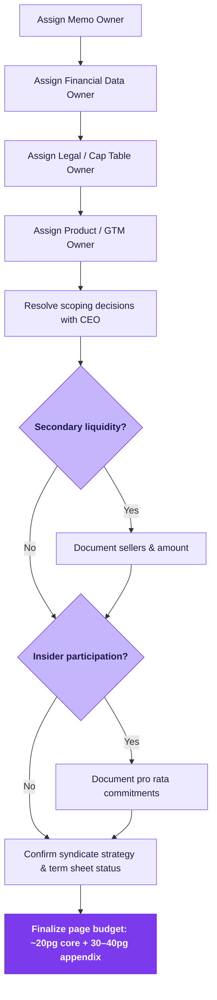

---

## 🚧 Gate 1: Metrics Definition Lock

> Lock all KPI definitions before drafting — the #1 cause of credibility failure.

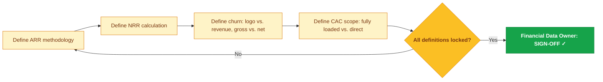

---

## Stage 1: The Hook — Company Overview

> *Sections 1–2 · Who are you, what do you do, and how did you get here?*

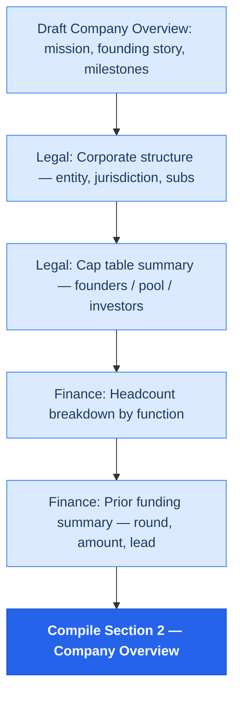

---

## Stage 2: The Opportunity

> *Sections 3–5 · Market sizing, problem/solution fit, and business model economics.*

```mermaid
flowchart TB
  subgraph MKT["Section 3 · Market Opportunity"]
    direction TB
    M1["TAM: top-down from industry reports"]:::s --> M2["TAM: bottom-up from customers × ACV"]:::s
    M2 --> M3["Reconcile top-down & bottom-up"]:::s
    M3 --> M4["Define SAM & SOM with penetration logic"]:::s
    M4 --> M5["Document 2–4 market tailwinds with sources"]:::s
    M5 --> M6["Address regulatory landscape"]:::s
    M6 --> M7["Compile Section 3"]:::c
  end
  subgraph PROB["Section 4 · Problem & Solution"]
    direction TB
    P1["Quantify customer pain in $ / hours / error rates"]:::s --> P2["Document current alternatives & shortcomings"]:::s
    P2 --> P3["Present core solution mechanism"]:::s
    P3 --> P4["Customer validation: NPS, quotes, case studies"]:::s
    P4 --> P5["Compile Section 4"]:::c
  end
  subgraph BIZ["Section 5 · Business Model"]
    direction TB
    B1["Revenue model: pricing tiers, billing, contracts"]:::s --> B2["Unit economics: LTV, CAC, LTV:CAC, payback"]:::s
    B2 --> B3["Gross margin profile & trend over time"]:::s
    B3 --> B4["Expansion revenue mechanics"]:::s
    B4 --> B5["Compile Section 5"]:::c
  end
  MKT --> PROB --> BIZ
  classDef s fill:#ccfbf1,stroke:#14b8a6,color:#134e4a
  classDef c fill:#0d9488,stroke:#0f766e,color:#fff,font-weight:700
```

---

## Stage 3: The Proof

> *Sections 6–8 · Traction evidence, competitive defensibility, and GTM execution.*

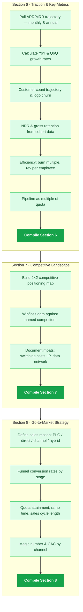

---

## Stage 4: The Team

> *Sections 9–10 · Leadership profiles, org capability, board & advisors.*

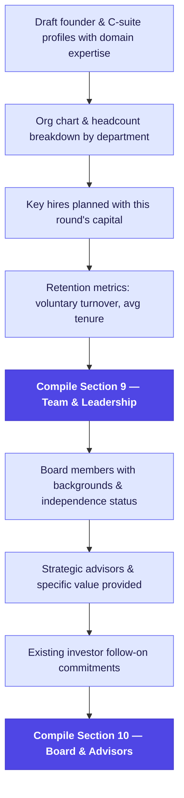

---

## 🚧 Gate 2: Financial Reconciliation

> Every number traces to the model → model traces to the GL → revenue consistent everywhere.

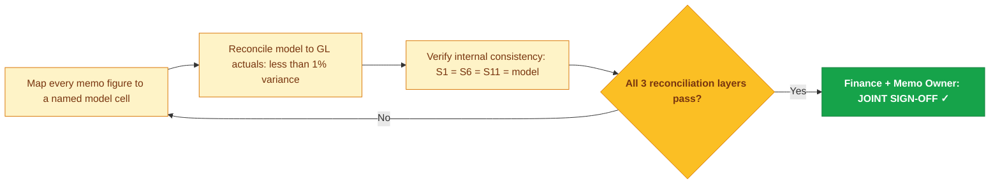

---

## Stage 5: The Numbers

> *Sections 11–13 · Historical financials, forward projections, and cash/runway.*

```mermaid
flowchart TB
  subgraph HIST["Section 11 · Historical Financials"]
    direction TB
    H1["P&L summary: 2–3 FY of revenue, COGS, OpEx, EBITDA"]:::s --> H2["Balance sheet: cash, working capital, debt"]:::s
    H2 --> H3["Cash flow summary & non-recurring items"]:::s
    H3 --> H4["Quarterly trends where contextual"]:::s
    H4 --> H5["Compile Section 11"]:::c
  end
  subgraph PROJ["Section 12 · Financial Projections"]
    direction TB
    F1["3–5 year revenue forecast with quarterly Y1 detail"]:::s --> F2["Key assumptions: customer growth, ACV, NRR, hiring"]:::s
    F2 --> F3["Scenario analysis: base, bull, bear cases"]:::s
    F3 --> F4["Revenue bridge: new logos + expansion − churn"]:::s
    F4 --> F5["Path to profitability & FCF trajectory"]:::s
    F5 --> F6["Compile Section 12"]:::c
  end
  subgraph CASH["Section 13 · Cash & Runway"]
    direction TB
    R1["Current cash position at most recent month-end"]:::s --> R2["Monthly burn rate: trailing 3-month average"]:::s
    R2 --> R3["Runway in months & post-raise runway"]:::s
    R3 --> R4["Cash waterfall: opening + raise − projected burn"]:::s
    R4 --> R5["Map milestones to capital required & timelines"]:::s
    R5 --> R6["Compile Section 13"]:::c
  end
  HIST --> PROJ --> CASH
  classDef s fill:#cffafe,stroke:#06b6d4,color:#164e63
  classDef c fill:#0891b2,stroke:#0e7490,color:#fff,font-weight:700
```

---

## 🚧 Gate 3: Cap Table & Legal Reconciliation

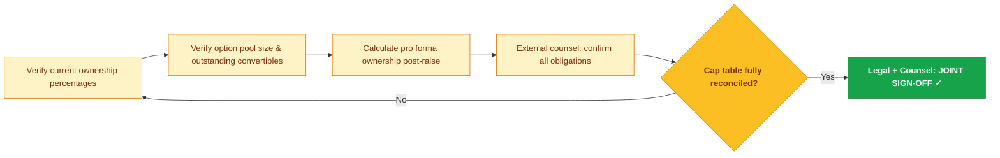

---

## Stage 6: The Ask

> *Sections 14–15 · Define the raise, justify the valuation, make the investment case.*

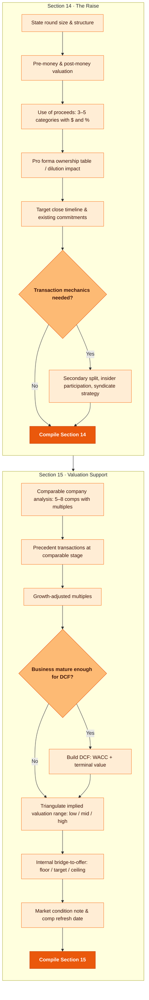

---

## Stage 7: Risk & Close

> *Sections 16–18 · Risks & mitigants, milestones, and appendix assembly.*

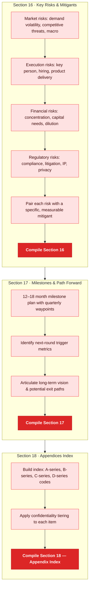

---

## ⭐ Executive Summary — Written Last

> *After all 17 sections are complete, write the exec summary. Max 1 page.*

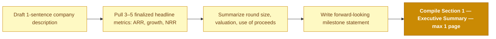

---

## 🚧 Gate 4: Appendix Completeness

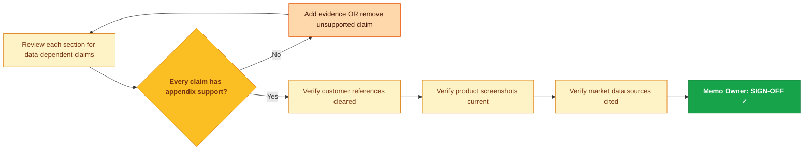

---

## ✅ Decision & Approval Block — Section 19

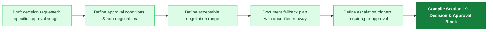

---

## 🚧 Gate 5: Final Sign-Off & Pre-Submission QC

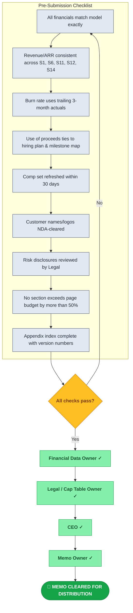

---

## Step Count

| Phase | Steps |
|---|:---:|
| Pre-Production: Scoping | 8 |
| Pre-Production: Ownership | 11 |
| Gate 1: Metrics Lock | 6 |
| Stage 1: The Hook | 6 |
| Stage 2: The Opportunity | 17 |
| Stage 3: The Proof | 16 |
| Stage 4: The Team | 9 |
| Gate 2: Financials | 5 |
| Stage 5: The Numbers | 17 |
| Gate 3: Cap Table | 6 |
| Stage 6: The Ask | 17 |
| Stage 7: Risk & Close | 13 |
| Executive Summary | 5 |
| Gate 4: Appendix | 7 |
| Decision Block | 6 |
| Gate 5: Sign-Off & QC | 15 |
| **Total** | **164** |

---

## Usage

**GitHub** — Push this `README.md` to any repo. GitHub renders Mermaid natively.

**Interactive** — Paste individual charts at [mermaid.live](https://mermaid.live)

**Export to SVG/PNG:**

```bash
npm install -g @mermaid-js/mermaid-cli
mmdc -i chart.mermaid -o chart.svg -w 2400
```

**Presentation** — Open `ic_memo_workflow_presentation.html` in any browser for a dark-mode, scroll-animated presentation with sidebar navigation.

---

*IC Production Blueprint v2.0 · Confidential*
